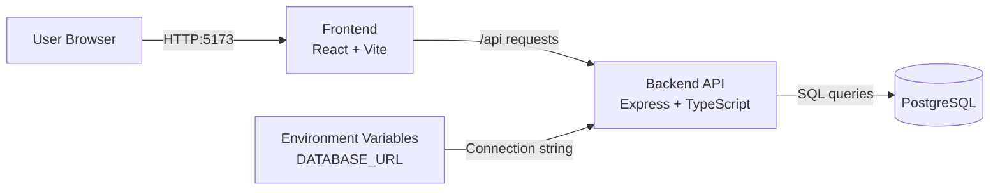

# HomeSync (PERN Monorepo)

**Live deployment:** `https://jonescg0.net`

## EARS Requirements
### Complete
1. When a user enters valid credentials, the system shall sign the user in.
2. When a user is signed in, the system shall maintain the user’s session until the user logs out or the session expires.
3. When a user is signed in, the system shall display the user’s name in the interface.
4. When a user logs out, the system shall end the user’s session and return the user to the login page.
5. When a user accesses the application from a mobile or desktop device, the system shall present a usable responsive layout.

### Not Complete
1. When a user opens the collaboration board, the system shall display the current board items stored in the database.
2. When a user changes a task status on the collaboration board, the system shall update the task status in the database and display the updated status in the interface.
3. When a user opens the listings page, the system shall display available property listings.
4. When a user selects a listing, the system shall display the details for that listing.
5. When a user opens a conversation, the system shall display the messages for that conversation.
6. When a user sends a message, the system shall store the message and display it in the conversation.
7. When the system is retrieving page data, the system shall display a loading indicator until the data is available.
8. If the system cannot complete a request, the system shall display an error message to the user.
9. When a user performs a supported action, the system shall process the action end-to-end through the frontend, backend, and database.

## App Summary

HomeSync solves a common real estate pain point: buyers, agents, and collaborators often communicate across disconnected tools, which causes lost context and missed updates. The primary user is a home buyer who needs one place to view listings, collaborate with an agent, and track tasks. This application provides a single web experience where collaboration and communication happen directly in the buying workflow. The frontend offers pages for listings, chat, and a collaboration board, while the backend exposes API routes for data operations. PostgreSQL stores persistent records for users, listings, conversations, messages, and board items. A working vertical slice is implemented: toggling a task from the collaboration board updates PostgreSQL and immediately reflects in the UI. The repo is organized as a minimal beginner-friendly monorepo so frontend and backend can run together with one command.

## Project Status (Sprint 1 of 3)

We are currently in **Sprint 1 of 3**. Sprint 1 focuses on delivering a working vertical slice that runs end‑to‑end (User → Frontend → Backend → Database) with polished core pages and basic UX:

- Home, login, and signup flows are implemented and visually aligned with the HomeSync brand.
- Listings, Collaboration Board, and Chat pages are wired to backend APIs where needed.
- One core interaction (toggling a task on the Collaboration Board) is fully implemented through the stack and persisted in PostgreSQL.

### Sprint Plan (High Level)

- **Sprint 1 – Vertical Slice & Core UX**

  - Implement core pages (Home, Listings, Board, Chat, Auth shell).
  - Deliver at least one fully working end‑to‑end feature (task toggle on Collaboration Board).
  - Establish basic visual identity and responsive layout for key screens.

- **Sprint 2 – Depth, Reliability & Accessibility**

  - Expand functionality on existing pages (richer board interactions, listings and chat behaviors).
  - Harden error handling and loading states.
  - Improve responsiveness and achieve or approach the target Lighthouse Accessibility score.

- **Sprint 3 – Polish, Production Readiness & Deployment**
  - Finalize UX polish across pages and devices.
  - Close gaps against the Definition of Done (accessibility, docs, deployment).
  - Ensure main is production‑ready and deployed with a clear feature list in this README.

## Definition of Done

For a feature or sprint to be considered **Done**, all of the following must be true:

- **Responsive UI**: Pages are responsive and look good on both desktop and mobile screens.
- **End‑to‑end flow**: Functionality works end‑to‑end (User → Frontend → Backend → Database).
- **Accessibility**: Lighthouse reports an Accessibility score **≥ 85%** on key flows.
- **Documentation**: This `README` is updated with an accurate list of working features.
- **Code integration**: Changes are merged into the `main` branch.
- **Deployment**: Changes are deployed to the production environment.

Sprint 1 aims to deliver a shippable vertical slice that already respects the Definition of Done for at least one core flow (Collaboration Board task toggling), and to lay the groundwork for sprints 2 and 3 to bring the whole product up to these standards.

## Tech Stack

- **Frontend framework:** React + TypeScript
- **Frontend tooling:** Vite, npm workspaces, Tailwind CSS, shadcn/ui-style components
- **Backend framework:** Express + TypeScript (`tsx` for dev runtime)
- **Database:** PostgreSQL (local), SQL schema/seed files in `db/`
- **Authentication:** Not implemented yet (planned)
- **External services/APIs:** None required for current infrastructure/vertical slice

## Architecture Diagram



## Prerequisites

Install the following software locally:

- **Node.js 20+** (includes npm): https://nodejs.org/en/download
- **PostgreSQL 16+**: https://www.postgresql.org/download/
- **psql in PATH** (usually installed with PostgreSQL): https://www.postgresql.org/docs/current/app-psql.html
- **Git**: https://git-scm.com/downloads

Verify installations:

```bash
node -v
npm -v
psql --version
git --version
```

## Installation and Setup

1. **Clone and enter the repo**

   ```bash
   git clone <your-repo-url>
   cd HomeSync
   ```

2. **Install dependencies (root + workspaces)**

   ```bash
   npm install
   ```

3. **Create your local environment file**

   - Copy `.env.example` to `.env`
   - Set `DATABASE_URL` to your local Postgres credentials.
   - Example:
     ```env
     DATABASE_URL=postgresql://postgres:<your_password>@localhost:5432/homesync
     ```

4. **Create the database**

   ```bash
   createdb -U postgres homesync
   ```

   If it already exists, this command can be skipped.

5. **Run schema and seed SQL**

   ```bash
   psql -U postgres -d homesync -f db/schema.sql
   bash db/migrate.sh "postgresql://postgres:<your_password>@localhost:5432/homesync"
   psql -U postgres -d homesync -f db/seed.sql
   ```

6. **Optional: confirm seed worked**
   ```bash
   psql -U postgres -d homesync -c "select count(*) as users from app_user;"
   psql -U postgres -d homesync -c "select count(*) as tasks from collab_item where item_type='task';"
   ```

## Running the Application

From the repo root:

```bash
npm run dev
```

This starts both services:

- Frontend: `http://localhost:5173`
- Backend API: `http://localhost:4000`

Open `http://localhost:5173` in your browser.

## Verifying the Vertical Slice

The implemented slice is: **task toggle on Collaboration Board -> backend API -> PostgreSQL update -> updated status shown in UI**.

1. Start the app with `npm run dev`.
2. Open `http://localhost:5173/board`.
3. In the **Tasks** column, click the circle/check icon next to a task.
4. Confirm the task status changes in the UI immediately.
5. Refresh the page and confirm the new status persists.
6. Verify directly in SQL:
   ```bash
   psql -U postgres -d homesync -c "select collab_item_id, title, status from collab_item where item_type='task' order by collab_item_id;"
   ```
   You should see the toggled task status updated (for example `todo` <-> `done`).

## Current Working Features

These features are currently implemented and participate in the vertical slice to varying degrees:

- **Home Page**

  - Marketing overview of HomeSync with hero, value proposition, and calls‑to‑action.
  - Navigation entry point to Listings, Collaboration Board, Chat, and Auth flows.

- **Authentication Shell (Login & Signup)**

  - Login and signup forms with validation using `react-hook-form` + `zod`.
  - Basic “remember me” behavior on login.
  - Role selection on signup (`buyer`, `realtor`, `collaborator`) to personalize future flows.

- **Listings Page**

  - Fetches listings from the backend (`/api/listings`) and renders responsive listing cards.
  - Each card shows price, address, key stats (beds, baths, square footage), and status badge.
  - Listing details open in a dialog with richer information (description, stats, actions).

- **Collaboration Board**

  - Vision board section with draggable inspiration cards.
  - Notes, Tasks, and Documents columns backed by `/api/board/items`.
  - **Task toggle**: Clicking the status icon sends a PATCH to `/api/board/items/:id/toggle`, updates PostgreSQL, and immediately updates the UI (our main vertical slice).

- **Chat Page**
  - Chat list sidebar that loads conversations from `/api/chats`.
  - Message window that fetches and displays messages for the selected chat from `/api/chats/:id/messages`.
  - Ability to send a message via POST to `/api/chats/:id/messages`, appending it to the current thread.

> **Note:** Some features may not yet fully meet the Definition of Done for accessibility score, production deployment, or all edge cases. Those gaps are expected to be closed in sprints 2 and 3.

## End Goal / Product Vision

When all three sprints are complete, HomeSync should feel like:

- **One shared workspace** for buyers, agents, and collaborators to coordinate listings, tasks, documents, and messages in a single place.
- A clear **journey from initial search through closing**, represented in the UI with timelines, task lists, and communication threads.
- A **production‑ready PERN application** with a cohesive visual identity, responsive layouts, and solid accessibility (Lighthouse Accessibility score ≥ 85% on key flows).
- A project that is easy for new contributors to set up, understand, and extend, thanks to a clean architecture and up‑to‑date documentation.

This repo is intentionally structured as a simple monorepo so that the entire HomeSync experience (frontend, backend, database) can be run, tested, and evolved as a single unit.

## Production Environment and PM2

On the EC2 host, the backend reads production variables from:

- `/home/ec2-user/HomeSync/.env`

Required keys:

```env
DATABASE_URL=postgresql://<user>:<url_encoded_password>@<host>:5432/<db_name>
JWT_SECRET=<long-random-secret>
ALLOWED_ORIGINS=https://yourdomain.com
NODE_ENV=production
PORT=4000
```

The deploy workflow writes this file on each deployment from GitHub Actions secrets. Manual edits are allowed, but they may be overwritten on the next deploy.
Deploys now run `db/schema.sql` and then `db/migrate.sh` before starting PM2.

Useful PM2 verification commands on EC2:

```bash
pm2 list
pm2 describe homesync-backend
pm2 status homesync-backend
pm2 logs homesync-backend --lines 100
```

## Repository Notes for GitHub

- `.env` and other environment files are ignored by `.gitignore`.
- `.env.example` is committed as the template.
- IDE-local folders like `.vscode/` are ignored.
- ERD is committed at `db/erd.png`.
